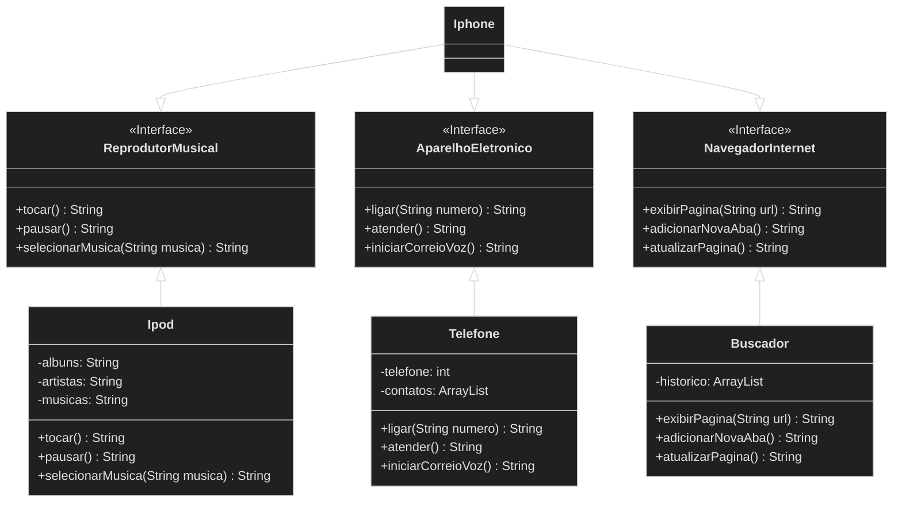

# licao-uml-iphone

### Minha lógica
Fiz o que foi pedido
1. **Reprodutor Musical**
   - Métodos: `tocar()`, `pausar()`, `selecionarMusica(String musica)`
2. **Aparelho Telefônico**
   - Métodos: `ligar(String numero)`, `atender()`, `iniciarCorreioVoz()`
3. **Navegador na Internet**
   - Métodos: `exibirPagina(String url)`, `adicionarNovaAba()`, `atualizarPagina()`
e criei as respectivas classes para as interfaces acima, com seus atributos que julguei serem importantes.
